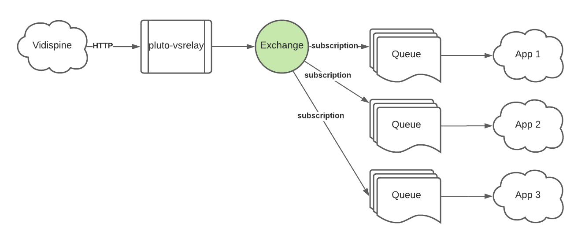
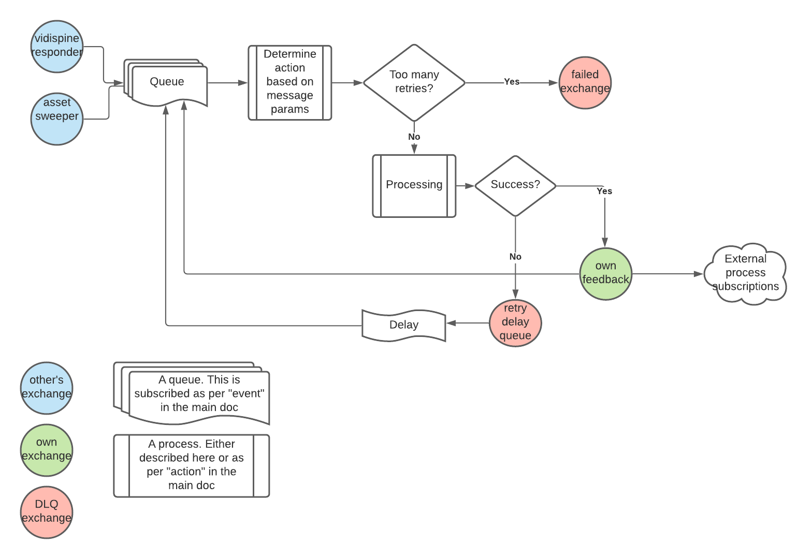

# pluto-storagetier

## What is it?

This is a monorepo, which contains a number of subprojects.  They are all pure-backend Scala projects, intended
to run against JVM 1.8.

Taken together, they are the components which allow pluto to move media from one storage tier to another.

Each specific transfer has its own component, i.e. online -> archive is one component, online -> nearline, etc.
A "component" in this case is a standalone app, built out as a Docker image which consists of the relevant
JVM and a collection of JARs with all the dependencies etc.

## How is it deployed?

The project is currently hosted on Gitlab and uses Gitlab's CI process to automatically build a deployable image
on every merge request and update to the main branch.

All tests are run as part of this process and dependencies are monitored via Snyk (https://snyk.io).  If either the tests
fail or a security vulnerability is introduced through dependencies, then the build will fail and no image will be
output at the end of it.

These are numbered based on the iteration, and the final images are then pushed across to our private Docker image
repo hosted in AWS.  This is configured for "immutable images", i.e. once a given iteration number has been pushed it
can't be over-written and a new one must be provided.

They are then deployed via manifests to our Kubernertes system which uses rotated credentials to access them.  As with
other "prexit" components, `pluto-versions-manager` can be used to interrogate the builds and quickly deploy updates.

## How do I build it locally?

The applications deploy to Kubernetes via Docker images. In order to build the project, you'll need:
- a JDK implementation at version 1.8 (later will not work with the MatrixStore libraries)
- sbt, the scala build tool (or an alternative like intellij)
- Docker on your workstation to build the images

Then it's as simple as:
```
$ sbt
sbt:pluto-storagetier> projects
[info] In file:/Users/andy_gallagher/workdev/pluto-storagetier/
[info] 	   common
[info] 	   mxscopy
[info] 	   nearline_archive
[info] 	   online_archive
[info] 	 * pluto-storagetier
sbt:pluto-storagetier> project nearline_archive
[info] set current project to nearline_archive (in build file:/Users/andy_gallagher/workdev/pluto-storagetier/)
sbt:nearline_archive> test
.
.
.
.
sbt:nearline_archive> docker:publishLocal
```

to run tests then compile and build a local version.  Dependencies are resolved and downloaded prior to compilation, so
internet access is required; and using a 3G connection definitely not recommended!

This should ultimately output a Docker image onto your local
Docker daemon as `guardianmultimedia/storagetier-online-nearline:DEV` which can then be run via
`docker run --rm  guardianmultimedia/storagetier-online-nearline:DEV`.

If you do so, however, it will most likely fail complaining that it needs configuration for rabbitmq, pluto-core, vidispine
or somesuch.

If you want to run locally it's best to first install prexit-local (https://gitlab.com/codmill/customer-projects/guardian/prexit-local)
which builds into a minikube environment and provides all of these elements.

With that installed, you can point your Docker configuration at the minikube instance and build on there:
```
$ $(minikube docker-env)  #point the local docker client to the minikube docker daemon
$ sbt
sbt:pluto-storagetier> projects
[info] In file:/Users/andy_gallagher/workdev/pluto-storagetier/
[info] 	   common
[info] 	   mxscopy
[info] 	   nearline_archive
[info] 	   online_archive
[info] 	 * pluto-storagetier
sbt:pluto-storagetier> project nearline_archive
[info] set current project to nearline_archive (in build file:/Users/andy_gallagher/workdev/pluto-storagetier/)
sbt:nearline_archive> test
.
.
.
.
sbt:nearline_archive> docker:publishLocal
```

Then you can use the manifests in https://gitlab.com/codmill/customer-projects/guardian/prexit-local/-/tree/master/kube/pluto-storagetier to
deploy from that DEV image into your local minikube.

For more information on prexit-local and minikube, you're best to start with https://gitlab.com/codmill/customer-projects/guardian/prexit-local/-/blob/master/README.md
and continue reading about Kubernetes from there.

Each pod contains a long-running process that starts up, subscribes to relevant events on the message bus (see later for details)
and then waits for messages to come and be processed. It's set up to terminate cleanly on a SIGINT (i.e. CTRL-C from the Terminal)
and a SIGTERM (i.e. termination from the OS or Kubernetes). It's perfectly safe (and encouraged) to run many instances
in parallel; because of the way that they use the message queue and data store there is no risk of conflicts.

## What are the components?

- `common` is not a component. It includes functionality which is shared across all of the components, such as data models and the
message processing logic
- `mxs-copy-components` is also not a component in its own right. It contains functionality to make it easier to use
the Java libraries for directly interfacing MatrixStore.
- `online_nearline` is a component which is responsible for performing data copies from the online storage to the nearline storage
- `online_archive` is a component which is responsible for performing data copies from the online storage to the archive.

## How do the components communicate?
The components communicate with each other, themselves and the rest of the Pluto system via the RabbitMQ
message bus.

For a good grounding in RabbitMQ terminology, have a look here: https://www.rabbitmq.com/getstarted.html.

The protocol used throughout the wider Pluto system is that when a component _does_ something that another
component may be interested in, it pushes a JSON message to its own _Exchange_.  Another component can then
receive this notification onto its own _Queue_ by _subscribing_ to the producer's _Exchange_.

In other words, a _producer_ owns the Exchange and a _consumer_ owns the queue.  

### Subscription
To take a concrete example, consider the fact that many different apps may want to be notified about
events from Vidispine e.g. the Deliverables component, different storage-tier components, etc.

Vidispine does not directly interface to RabbitMQ but sends HTTP messages to given endpoints, so we use
a tool called "pluto-vsrelay" (see https://gitlab.com/codmill/customer-projects/guardian/pluto-vs-relay) which
receives these HTTP notifications and pushes them to an Exchange.

The key point is that `pluto-vsrelay` does not need to know or care about what other processes may want to consume
these messages.  Furthermore, it is responsible for "declaring" (in RabbitMQ parlance) the exchange i.e.
ensuring that it is created and configured properly.

Say that we now have a new app that needs to know about some kind of specific event from Vidispine, e.g. an
item metadata change.

Our app "declares" its own _queue_ in RabbitMQ and asks the broker (RabbitMQ server) to _subscribe_ this queue onto the Exchange
that pluto-vsrelay created.  In this way events that are pushed to the Exchange will be copied to the queue.
Any number of queues can be subscribed to an exchange, and they will _all_ receive the same messages from the exchange.

As the name suggests, a _queue_ will _hold_ a message until it is consumed.  An exchange, on the other hand, will
pass a message on to subscribers and then forget about it.



### Competing Consumers
Multiple instances of our app share the _same_ queue (the "competing consumers" pattern - https://www.enterpriseintegrationpatterns.com/patterns/messaging/CompetingConsumers.html)
When our app receives a message, it remains on the broker but is "hidden" to other consumers.  Once our app
instance has finished processing, it can either `ack` the message to the broker - which means indicate that it was
processed successfully and can be deleted - or `nack` the message, indicating that it was not processed successfully.
A `nack` contains an instruction to either re-queue the message or discard it (optionally to a dead-letter exchange).
If the app's connection to the broker terminates before either is received, then the message is automatically
re-queued so another instance can pick it up.

In this way it does not matter if our app crashes or is restarted for some reason outside of our control, because
if it was in the middle of something then that operation will be re-tried.

It is important, though, to ensure that operations each app performs will not fail
if they are being retried over a partially-completed attempt.

### Routing Keys
You can imagine, though, that in this example there are a lot of other events coming from Vidispine that
our app is _not_ interested in (we only want item metadata updates).  It would be nice if we could only
receive onto our queue these specific events rather than everything.

This is where the concept of a "routing key" comes in (see https://www.rabbitmq.com/tutorials/tutorial-four-python.html).

All the exchanges used in Pluto are "topic" exchanges, meaning that they _require_  a routing key to be present
on a message when it is sent.

A routing key is a set of strings separated by the period `.` character - e.g. `vidispine.item.metadata.modify`.
RabbitMQ itself does not care about the specific content or meaning of the routing key, but we stick to
a least specific -> most specific logic (in this case, literally `modify` the `metadata` of an `item` 
in `vidispine`).

When you make a subscription to a Topic exchange, you need to pass in a specification for the routing key(s) that
you want to receive.  The wildcard characters `*` and `#` are useful here - `*` means "match anything in this part of
the routing key" and `#` means "match anything from here on in". 
For example: 
 - `vidispine.item.#` would match `vidispine.item.metadata.modify` and `vidispine.item.shape.create` etc.
 - `vidispine.item.*.create` would match `vidispine.item.shape.create` but not `vidispine.item.metadata.modify`.

You can see these subscriptions in action in the respective Main classes of the components:
```scala
      ProcessorConfiguration(
        "assetsweeper",
        "assetsweeper.asset_folder_importer.file.#",
        "storagetier.onlinearchive.newfile",
        new AssetSweeperMessageProcessor(plutoConfig)
      )
```
Is the code that sets up an instance of the AssetSweeperMessageProcessor class to receive all `file` messages
from `asset_folder_importer` via the `assetsweeper` exchange and sends success messages with a routing key of
`storagetier.onlinearchive.newfile.success` to the component's designated output exchange.

`ProcessorConfiguration` is defined in [ProcessorConfiguration.scala](common/src/scala/com/gu/multimedia/storagetier/framework/ProcessorConfiguration.scala)

## How do the 'components' work?

### Application architecture

All of the executable components follow the same pattern. At heart they are console-based Scala apps and start with a
Main function inside a static class called Main.  This reads its settings from environment variables and starts up instances
of the `MessageProcessingFramework` and a number of `MessageProcessor` instances to do the actual work.

Each of these `MessageProcessor` instances usually lives in a class which is at the root level of the component and many
then have other dependencies which they can call out to, e.g. MatrixStore routines, Vidispine request building/parsing etc.

Every `MessageProcessor` instance starts with the `handleMessage` definition above, which then calls other function in the
class, which call more dependencies, etc. etc. etc.

Many operations are performed with the help of Akka Streams, especially sending material to and from the MatrixStore appliances
and HTTP integration with services like pluto-core and Vidispine.

###Common logic
Each component is based around the same fundamental logic, which is encapsulated in the `com.gu.multimedia.storagetier.framework` module.
They are designed to respond to messages that occur elsewhere in the system which are notified via the message queue,
and then ensure that a copy of the given media is present in the required storage tier.  Once this has been done, 
another message is output indicating that the operation took place.

Failures are split into two kinds; "retryable" and "permanent" failures.  
- If a permanent failure (i.e. one for which there is no point retrying) occurs during the processing of a message, 
then the original message is sent to a dead-letter queue via a dead-letter exchange, with a number of fields set to 
indicate what went wrong.  
- If a retryable failure occurs, then the original message is sent to a "retry" queue via a 
retry exchange.  The "retry" queue is not directly subscribed, but all messages have a TTL (time-to-live) value set on 
them.  Once this TTL expires they are re-routed back to the "retry-input" exchange, which is picked up by an app instance 
and replayed. In this way, retries are kept outside the scope of any running instance so it is safe for instances to 
crash or be restarted at any point.

Schematically, the logic looks like this:



In practise, this is represented by the [MessageProcessingFramework](common/src/scala/com/gu/multimedia/storagetier/framework/MessageProcessingFramework.scala)
class.
In order to be initialised, this requires a list of [ProcessorConfiguration](common/src/scala/com/gu/multimedia/storagetier/framework/ProcessorConfiguration.scala)
instances which associates a "processor" (i.e. an implementation of the [MessageProcessor](common/src/scala/com/gu/multimedia/storagetier/framework/MessageProcessor.scala)
interface) with an exchange to subscribe to, a routing key spec to narrow down the subscription and an
"outgoing" routing key to use for success messages.

You can see this being set up in [Main.scala](online_archive/src/main/Main.scala).

Once initiated, it will connect to rabbitMQ and declare a queue with a specific name. This name is shared
between all instances, so we have a single queue for the app that receives messages from all the different exchanges
(including our own, and our own retries).

The logic in `MessageProcessor` takes care of routing an incoming message to the correct `MessageProcessor` instance,
based on the incoming exchange name and the routing key, both of which are carried in the message's metadata.

The `handleMessage` method of the `MessageProcessor` instance is then called with the parsed message JSON and the
routing key that it came from.

The Framework then waits for the Future returned from the `MessageProcessor` to complete. The action it takes
depends on the value of the Future:
- a Right signifies success. The Right should contain a JSON object to send out, which is serialised to a string
and sent onto the app's output exchange with the routing key given in the ProcessorConfiguration. The original
message is `ack`'d on the broker, removing it from the queue
- a Left signifies a retryable failure. The Left should contain a string describing the failure, which is logged.
  - The original message is `nack`'d _without_ retry on the original queue and a copy is sent to the "retry exchange".
  - The "Retry exchange" is subscribed by the "retry queue", which has a Time-To-Live attribute set on it. 
  - The message copy _also_ has a Time-To-Live attribute set, and whichever is the lower of these two settings is used.
  - Once the time-to-live is expired, the message broker forwards it on to the designated "dead-letter exchange" of the
retry queue, which then immediately forwards it back to the input queue.
  - In this way we have a retry loop that can act without blocking application instances and allowing other content to be
processed at the same time
- a Failure (i.e. failed future) signifies a permanent failure. The exception message should contain a string describing
the failure, which is logged.
  - The original message is `nack`'d without retry on the original queue. 
  - A copy is sent to the "dead-letter exchange" which is subscribed by the dead-letter queue ("DLQ").  This copy has extra
metadata fields set on it indicating the failure and where it originally came from.

### Implementing a processor
In order to actually _do_ something with a message, you must create a subclass (well an implementation really) of the
[MessageProcessor](common/src/scala/com/gu/multimedia/storagetier/framework/MessageProcessor.scala) trait.

This is as simple as providing an implementation of the following method in your own class:

```scala
def handleMessage(routingKey:String, msg:Json):Future[Either[String,MessageProcessorReturnValue]]
```

and following the protocol above to represent success, retryable failure or permanent failure.

`MessageProcessorReturnValue` is defined in [MessageProcessorReturnValue.scala](common/src/scala/com/gu/multimedia/storagetier/framework/MessageProcessorReturnValue.scala)
and exists to allow success messages to be sent to multiple locations.

In practise though, you can normally just return a circe Json object and rely on an implicit converter, like this:
```scala
import com.gu.multimedia.storagetier.framework.MessageProcessorConverters._
import io.circe.generic.auto._
import io.circe.syntax._

class MyProcessor extends MessageProcessor {
  def handleMessage(routingKey:String, msg:Json):Future[Either[String,MessageProcessorReturnValue]] = {
    // do stuff here.......
    Future(Right(myDomainObject.asJson))
  }
}
```


## Logging

When the system is actually running in practise, it quickly becomes very difficult to understand the logs.
This is because you potentially have a lot of messages, some retrying, some new, being processed across a lot of instances.
Not every failure is a problem; some messages are expected to loop through a few retries before an external system has
"caught up" (e.g. validating that a file exists in the archive storage).

For this reason, we use ELK (Elasticsearch-Logstash-Kibana) to  parse and warehouse the logs.  Each log line has a format
which is defined in a `resources/logback.xml` configuration file and looks like this:

```
%d{yyyy-MM-dd'T'HH:mm:ss.SSSZZ} [%thread] [%X{msgId};%X{retryAttempt};%X{routingKey};%X{exchange};%X{isRedeliver}] %-5level %logger{36} - %msg%n
```

i.e.:
- timestamp
- thread ID
- message ID that is being processed. This is arbitrary and set by the sender; we normally use UUIDs.  Allows you to cross-reference the events or filter
across multiple retries
- retry attempt counter. Starts at 0, this is incremented every time a message is retried. Note that a message will not necessarily
be retried on the same instance that received it before
- routing key of the message that is being processed
- exchange that sent the message that is being processed
- a boolean flag indicating whether the message has been redelivered by the broker (i.e. because something failed)
- log level
- class/logger name
- message

These fields are parsed out in logstash and can be used for filtering, so you can quickly zoom in on why a specific file 'X' seems
to be failing.